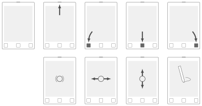

# Shapes library

This is a library of shapes related to the reMarkable tablet intended to be used for illustrating the documentation of community projects built around the device.

The following symbols are defined:

* Shape of a reMarkable 1 tablet.
* Shape of a reMarkable pen.
* Symbol for tapping the screen.
* Symbol for swiping in either direction.

[See the library definition in TikZ →](remarkable.tex)\
[See an example usage →](example.tex)

